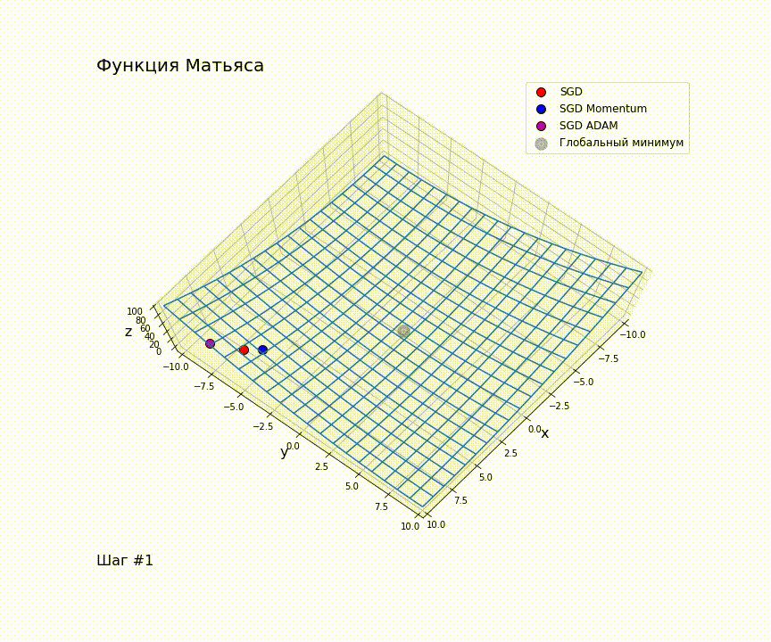

## Лабораторная работа №1

### Формулировка ТЗ:

*   Выбрать две тестовые функции для оптимизации и визуализировать их (функция Матьяса и функция трехгорбого верблюда)
*   Реализовать алгоритм SGD (для функции и для датасета)
*   Реализовать алгоритм SGD с моментной модификацией
*   Реализовать алгоритм SGD с модификацией ADAM
*   Применить алгоритмы к тестовым функциям
*   Анимировать применение алгоритмов к тестовым функциям

### Ссылка на Colab:

    https://colab.research.google.com/drive/105hcad9MvBq9fIa06_LDARLvzDoW4K8m?usp=sharing

