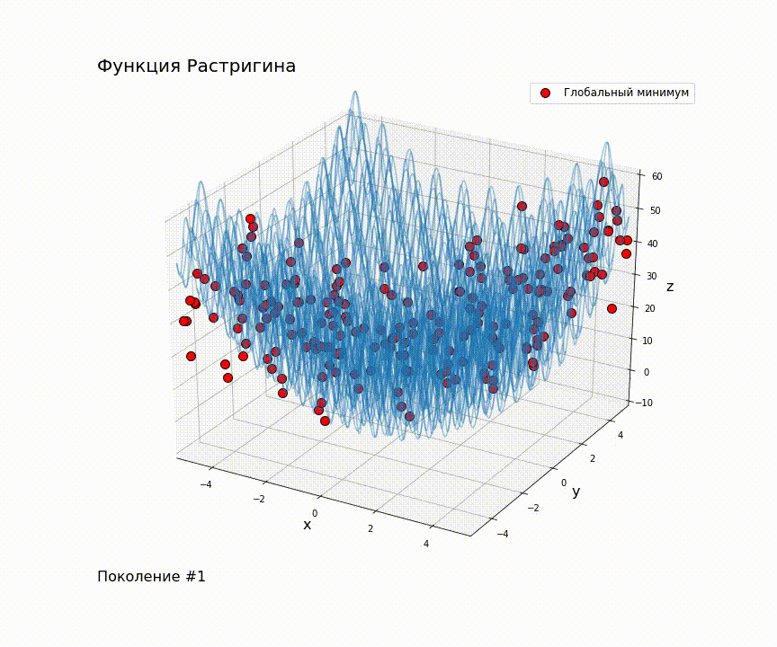

## Лабораторная работа №2

### Формулировка ТЗ:

*   **Часть 1.** Найти оптимумы тестовых функций оптимизации 2-мя алгоритмами библиотеки pygmo.

     *Для решения были выбраны алгоритмы Simple Genetic Algorithm и Self-adaptive Differential Evolution. В качестве тестовых функций для оптимизации использовались           функция Растригина и функция Леви №13.*

*   **Часть 2.** Сконструировать нефункциональную (алгоритмическую) проблему оптимизации и решить ее алгоритмом библиотеки pygmo.

     *Для решения была выбрана задача о рюкзаке: есть рюкзак определенной вместимости. Есть конечное количество вещей разного веса и ценности, которые в этот рюкзак можно     положить, но поместяться не все вещи. Цель: найти такой набор вещей, которые можно сложить в рюкзак, чтобы при органиченой вместимости рюкзака была достигната           максимально возможная его ценность.*

### Ссылка на Colab:

    https://colab.research.google.com/drive/12bN7FMGWlSFz4UZox42DjvnI_cmm8Z36?usp=sharing

