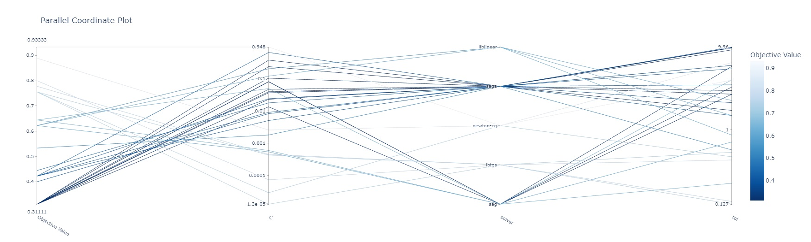

## Лабораторная работа №4

### Формулировка ТЗ:

*   Найти оптимум функциии с помощью Optuna
*   Осуществить подбор параметров модели классификации с помощью Optuna

### Ссылка на Colab:
    https://colab.research.google.com/drive/1-2io-mKNm1aQtVluVhOrFsEBWCujNZLv?usp=sharing

