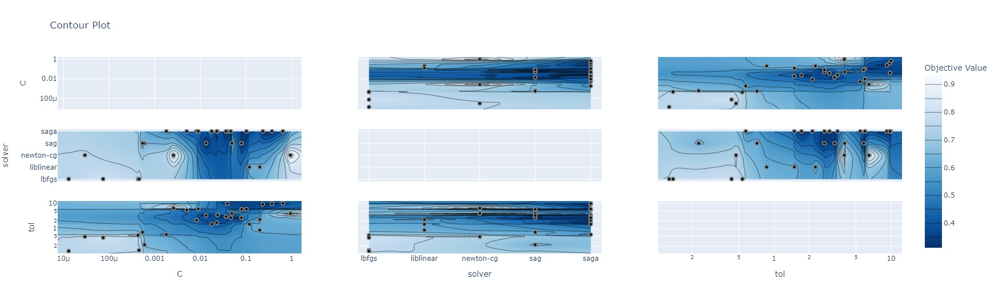

## Лабораторная работа №4

### Формулировка ТЗ:

*   **Часть 1.** Найти оптимум тестовых функций для оптимизации с помощью Optuna.

     *В качестве тестовых функций для оптимизации использовались функция Матьяса и функция трехгорбого верблюда.*

*   **Часть 2.** Осуществить подбор параметров модели классификации с помощью Optuna.

     *Для задачи классификации был выбран датасет sklearn.datasets.load_wine (3 класса) и классификатор sklearn.linear_model.LogisticRegression. В качестве глобальных параметров рассматривались: C, lot, solver.*

### Ссылка на Colab:
    https://colab.research.google.com/drive/1-2io-mKNm1aQtVluVhOrFsEBWCujNZLv?usp=sharing

